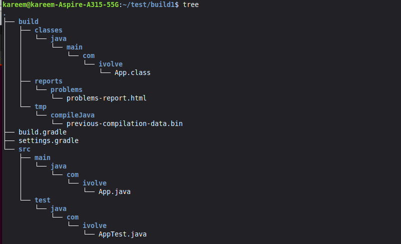
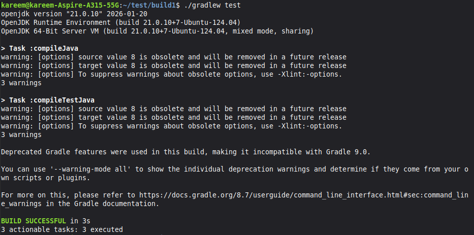

# Lab 1: Building and Packaging Java Applications with Gradle


## Steps Completed

---

### ✅ Step 1: Clone & Explore Project Structure



After cloning the source code from [https://github.com/Ibrahim-Adel15/build1.git](https://github.com/Ibrahim-Adel15/build1.git), the project structure was explored using the `tree` command. The project follows a standard Gradle layout:
- `src/main/java/com/ivolve/App.java` — Main application source file
- `src/test/java/com/ivolve/AppTest.java` — Unit test file


---

### ✅ Step 2: Run Unit Tests



Unit tests were executed using the Gradle wrapper command:
```bash
./gradlew test
```
Both `compileJava` and `compileTestJava` tasks completed successfully. The build finished with **BUILD SUCCESSFUL** in 3 seconds with 3 actionable tasks executed.

---

### ✅ Step 3: Run the Application


The packaged JAR artifact was executed using:
```bash
java -jar build/libs/ivolve-app.jar
```
The application ran successfully and printed the expected output:
```
Hello iVolve Trainee
```

---

