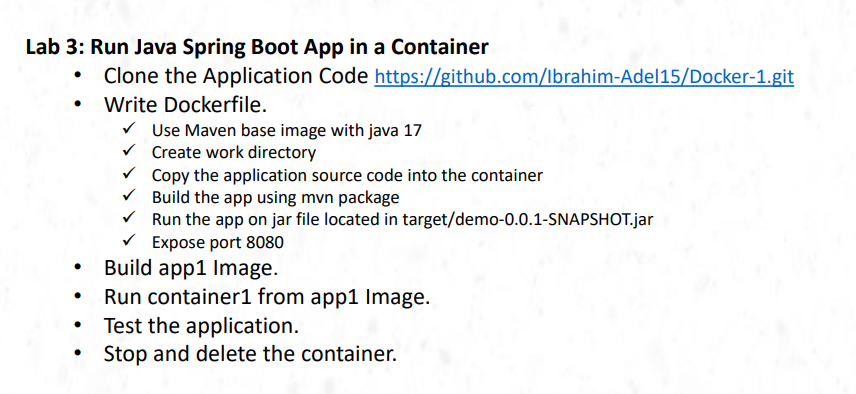
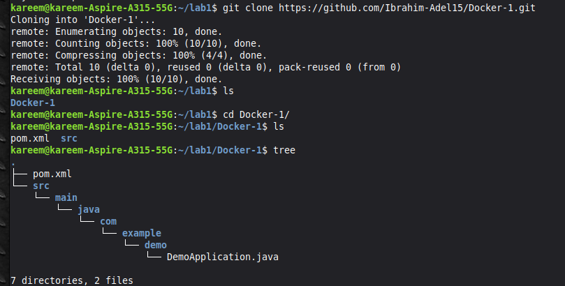
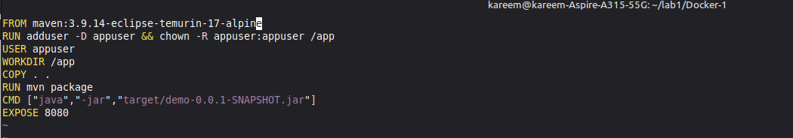
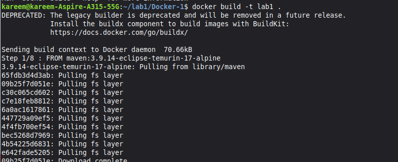
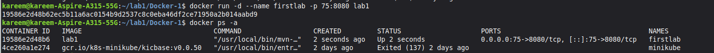
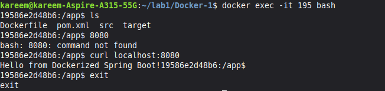
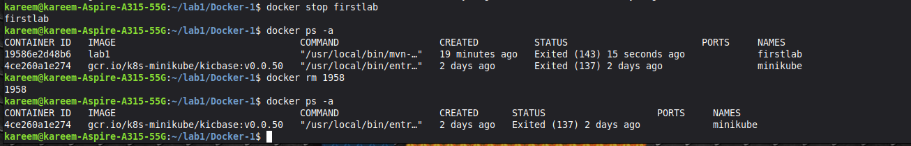

# Lab 3: Run Java Spring Boot App in a Container 🐳



## Objective
Run a Java Spring Boot application inside a Docker container using a Maven base image.

---

## Steps

### 1. Clone the Application
```bash
git clone https://github.com/Ibrahim-Adel15/Docker-1.git
cd Docker-1
```

The project structure:
```
.
├── pom.xml
└── src
    └── main
        └── java
            └── com
                └── example
                    └── demo
                        └── DemoApplication.java
```



---

### 2. Write the Dockerfile




---

### 3. Build the Docker Image
```bash
docker build -t lab1 .
```

Docker pulls the base image and builds the app layer by layer.



---

### 4. Run the Container
```bash
docker run -d --name firstlab -p 75:8080 lab1
```

- `-d` → Run in background (detached mode)
- `--name firstlab` → Name the container
- `-p 75:8080` → Map port 75 on host to port 8080 in container




---

### 5. Test the Application
```bash
docker exec -it firstlab bash
curl localhost:8080
```

Response:
```
Hello from Dockerized Spring Boot!
```



---

### 6. Stop and Delete the Container
```bash
docker stop firstlab
docker rm 1958
docker ps -a
```



---

## Summary

| Step | Command |
|------|---------|
| Clone repo | `git clone <url>` |
| Build image | `docker build -t lab1 .` |
| Run container | `docker run -d --name firstlab -p 75:8080 lab1` |
| Test app | `curl localhost:8080` |
| Stop container | `docker stop firstlab` |
| Remove container | `docker rm <id>` |
