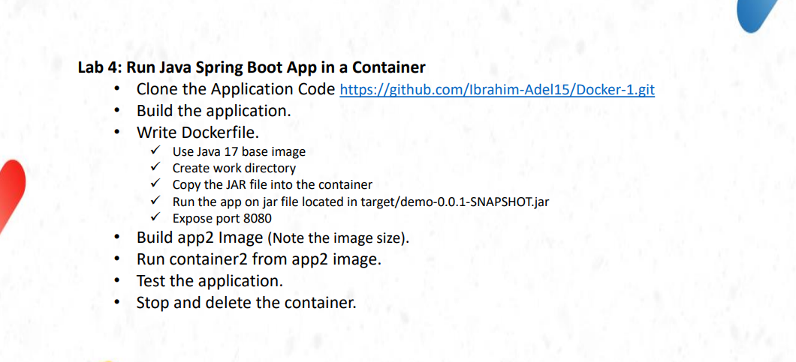
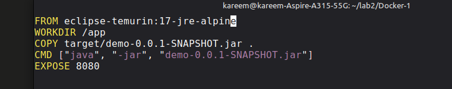
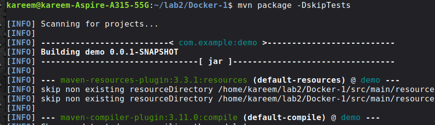
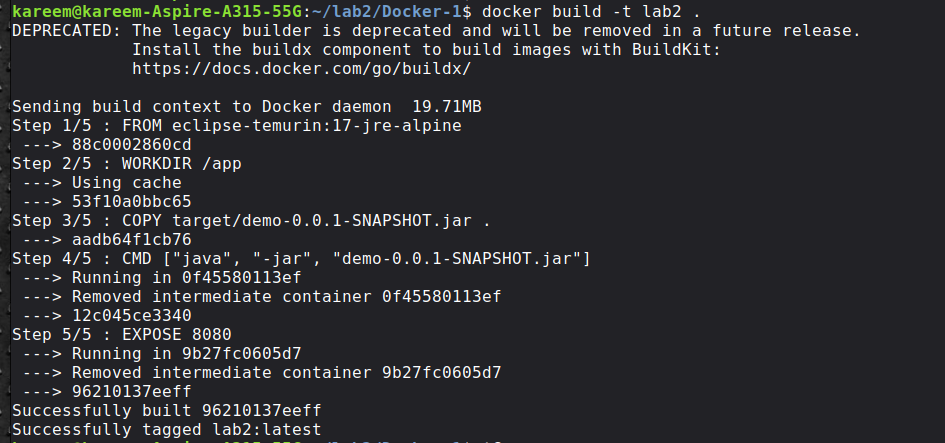
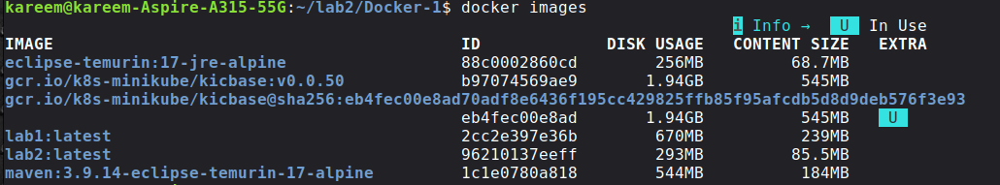
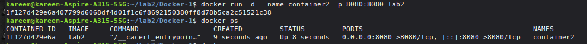

# Lab 4: Run Java Spring Boot App in a Container 🐳
 
## Objective
Build the Java application **locally** first, then copy only the JAR file into a lightweight Docker container using a Java 17 runtime image.
 
> **Key Difference from Lab 3:**
> | | Lab 3 | Lab 4 |
> |---|---|---|
> | Build happens | Inside the container (Maven image) | On the local machine |
> | Base image | `maven:3.9.14-eclipse-temurin-17-alpine` | `eclipse-temurin:17-jre-alpine` |
> | Image size | 670MB | 293MB |
> | What goes in container | Source code + Maven + JDK | JAR file only |
 
---
 
## Steps
 
### 1. Clone the Application
```bash
git clone https://github.com/Ibrahim-Adel15/Docker-1.git
cd Docker-1
```
 
---
 
### 2. Write the Dockerfile
 
 

 
> **Note:** We use `17-jre-alpine` not `17-jdk` because we only need to **run** the app, not compile it. JRE is smaller than JDK.
 
---
 
### 3. Build the App Locally
```bash
mvn package -DskipTests
```
 

This generates `target/demo-0.0.1-SNAPSHOT.jar` on your machine.
 
---
 
### 4. Build the Docker Image
```bash
docker build -t lab2 .
```
 

 
---
 
### 5. Compare Image Sizes
```bash
docker images
```
 

| Image | Size |
|---|---|
| `lab1` (Maven inside) | 670MB |
| `lab2` (JAR only) | **293MB** ✅ |
 
---
 
### 6. Run the Container
```bash
docker run -d --name container2 -p 8080:8080 lab2
docker ps
```
 

 
---
 
### 7. Test the Application
```bash
curl localhost:8080
# Hello from Dockerized Spring Boot!
```
 
---
 
### 8. Stop and Delete the Container
```bash
docker stop container2
docker rm container2
```
 
---
 
## Summary
 
| Step | Command |
|------|---------|
| Clone repo | `git clone <url>` |
| Build JAR locally | `mvn package -DskipTests` |
| Build image | `docker build -t lab2 .` |
| Run container | `docker run -d --name container2 -p 8080:8080 lab2` |
| Test app | `curl localhost:8080` |
| Stop container | `docker stop container2` |
| Remove container | `docker rm container2` |
 
