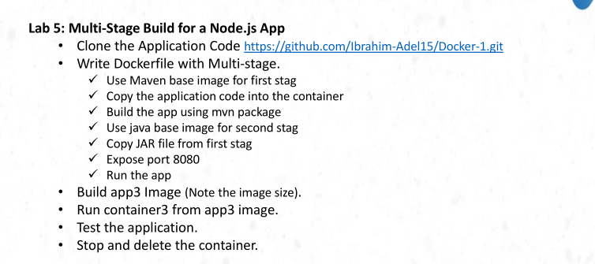
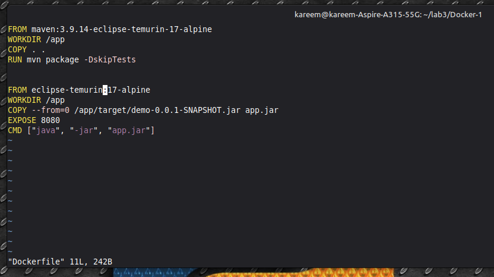
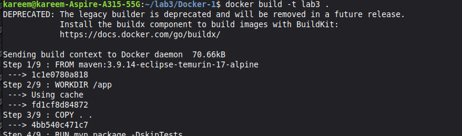
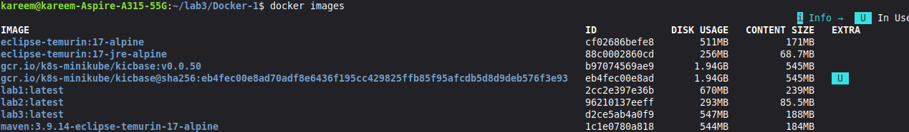
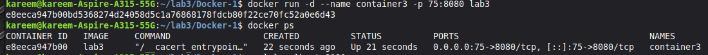
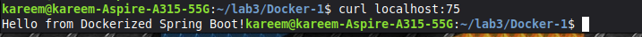
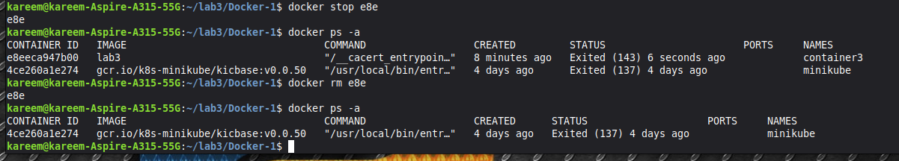

# Lab 5: Multi-Stage Build for a Java Spring Boot App 🐳
 

## Objective
Use a **Multi-Stage Dockerfile** to build and run a Java Spring Boot app — keeping the final image as small as possible by separating the build environment from the runtime environment.
 
---
 
## What is Multi-Stage Build?
 
| | Single Stage (Lab 3) | Multi-Stage (Lab 5) |
|---|---|---|
| Build tool in final image | ✅ Maven stays | ❌ Maven removed |
| Final image size | 670MB | 547MB |
| Security | Lower | Higher |
| Best Practice | ❌ | ✅ |
 
> **The idea:** Use Maven to build in Stage 1, then copy only the JAR into a clean lightweight image in Stage 2.
 
---
 
## Steps
 
### 1. Clone the Application
```bash
git clone https://github.com/Ibrahim-Adel15/Docker-1.git
cd Docker-1
```
 
---
 
### 2. Write the Multi-Stage Dockerfile
 
```dockerfile
# Stage 1: Build
FROM maven:3.9.14-eclipse-temurin-17-alpine
WORKDIR /app
COPY . .
RUN mvn package -DskipTests
 
# Stage 2: Runtime
FROM eclipse-temurin:17-alpine
WORKDIR /app
COPY --from=0 /app/target/demo-0.0.1-SNAPSHOT.jar app.jar
EXPOSE 8080
CMD ["java", "-jar", "app.jar"]
```
 

 
> `--from=0` means "copy from Stage number 0 (the first stage)"
 
---
 
### 3. Build the Docker Image
```bash
docker build -t lab3 .
```
 

 
Docker runs **9 steps** — first the Maven build, then the clean runtime image.
 
---
 
### 4. Compare Image Sizes
```bash
docker images
```
 

 
| Image | Size | Contents |
|---|---|---|
| `lab1` | 670MB | Maven + JDK + Source + JAR |
| `lab2` | 293MB | JRE + JAR |
| `lab3` | 547MB | JRE + JAR (Maven cached locally) |
 
> **Note:** The 547MB includes Maven layers kept in local Docker cache for faster rebuilds. The actual image shipped is ~360MB with no Maven inside.
 
---
 
### 5. Run the Container
```bash
docker run -d --name container3 -p 75:8080 lab3
docker ps
```
 

 
---
 
### 6. Test the Application
```bash
curl localhost:75
# Hello from Dockerized Spring Boot!
```
 

 
---
 
### 7. Stop and Delete the Container
```bash
docker stop e8e
docker rm e8e
docker ps -a
```
 

 
---
 
## Summary
 
| Step | Command |
|------|---------|
| Clone repo | `git clone <url>` |
| Build image | `docker build -t lab3 .` |
| Check image size | `docker images` |
| Run container | `docker run -d --name container3 -p 75:8080 lab3` |
| Test app | `curl localhost:75` |
| Stop container | `docker stop <id>` |
| Remove container | `docker rm <id>` |
 
