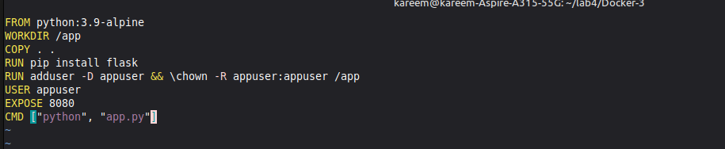
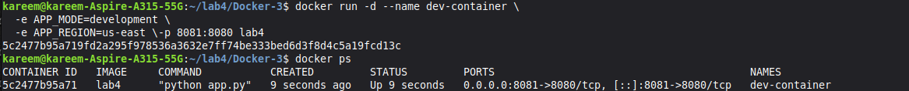
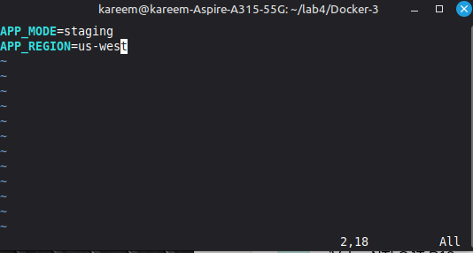
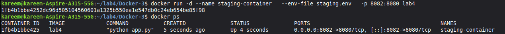
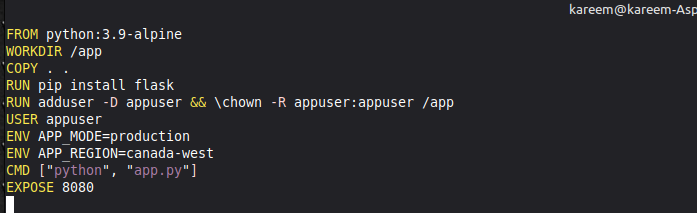
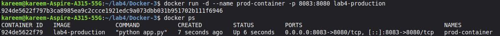
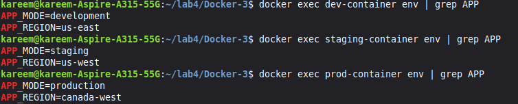

# Lab 6: Managing Docker Environment Variables Across Build and Runtime 🐳
 

 
## Objective
Run the same Docker image with different configurations using 3 different ways to pass environment variables — without changing the source code.
 
---
 
## What are Environment Variables?
 
Instead of hardcoding config inside the app:
```python
# ❌ Bad - hardcoded
MODE = "development"
```
 
The app reads them from the environment:
```python
# ✅ Good - flexible
MODE = os.environ.get('APP_MODE')
```
 
This means the **same image** can run as development, staging, or production just by changing the variables passed to it.
 
---
 
## Steps
 
### 1. Clone the Application
```bash
git clone https://github.com/Ibrahim-Adel15/Docker-3.git
cd Docker-3
```
 
---
 
### 2. Write the Dockerfile
 
```dockerfile
FROM python:3.9-alpine
WORKDIR /app
COPY . .
RUN pip install flask
RUN adduser -D appuser && chown -R appuser:appuser /app
USER appuser
EXPOSE 8080
CMD ["python", "app.py"]
```
 

 
> **Note:** `pip install` runs as root first, then we switch to appuser for security.
 
---
 
### 3. Build the Image
```bash
docker build -t lab4 .
```
 
---
 
## Running the 3 Containers
 
### i. Variables in the Command `-e`
```bash
docker run -d --name dev-container \
  -e APP_MODE=development \
  -e APP_REGION=us-east \
  -p 8081:8080 lab4
```
 

 
 
---
 
### ii. Variables from a File `--env-file`
 
Create `staging.env`:
```
APP_MODE=staging
APP_REGION=us-west
```
 

 
 
```bash
docker run -d --name staging-container \
  --env-file staging.env \
  -p 8082:8080 lab4
```
 

 
 
---
 
### iii. Variables in the Dockerfile `ENV`
 
```dockerfile
FROM python:3.9-alpine
WORKDIR /app
COPY . .
RUN pip install flask
RUN adduser -D appuser && chown -R appuser:appuser /app
USER appuser
ENV APP_MODE=production
ENV APP_REGION=canada-west
CMD ["python", "app.py"]
EXPOSE 8080
```
 

 
 
```bash
docker build -t lab4-production .
docker run -d --name prod-container -p 8083:8080 lab4-production
```
 

 
 
---
 
### 4. Verify All Containers
 
```bash
docker exec dev-container env | grep APP
docker exec staging-container env | grep APP
docker exec prod-container env | grep APP
```
 

 
 
| Container | APP_MODE | APP_REGION |
|---|---|---|
| dev-container | development | us-east |
| staging-container | staging | us-west |
| prod-container | production | canada-west |
 
---
 
## Summary: 3 Ways to Pass Environment Variables
 
| Method | Command | Best For |
|---|---|---|
| `-e` flag | `docker run -e KEY=VALUE` | Quick testing |
| `--env-file` | `docker run --env-file file.env` | Multiple variables |
| `ENV` in Dockerfile | `ENV KEY=VALUE` | Default values |
 
> **Production Rule:** Never put passwords in Dockerfile — use `--env-file` or Docker Secrets instead 🔐
 
